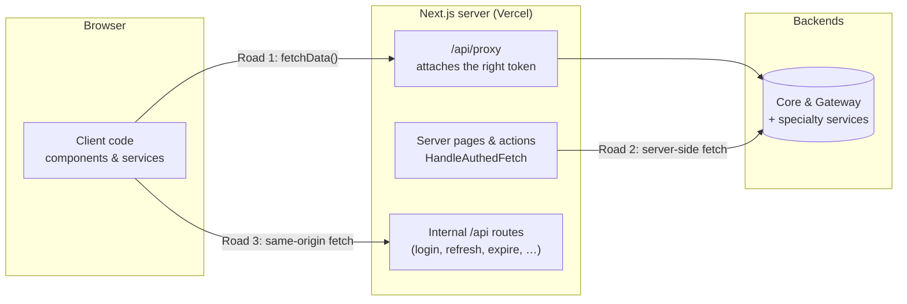
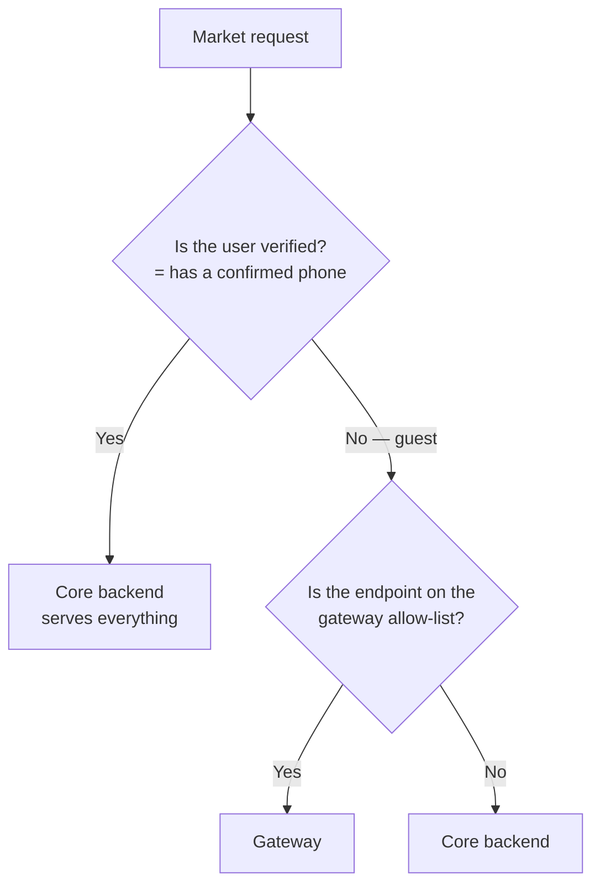
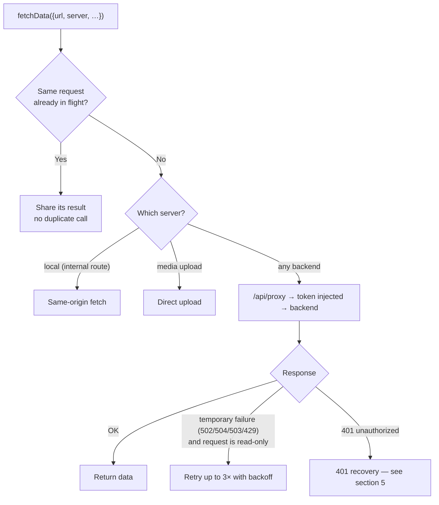
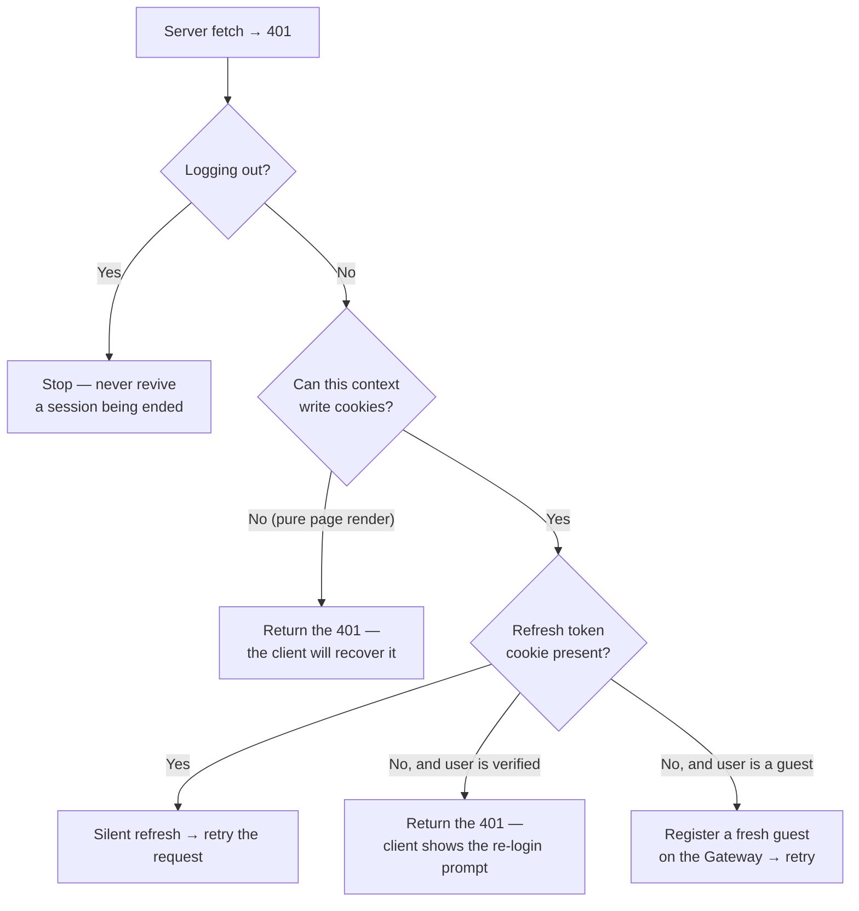
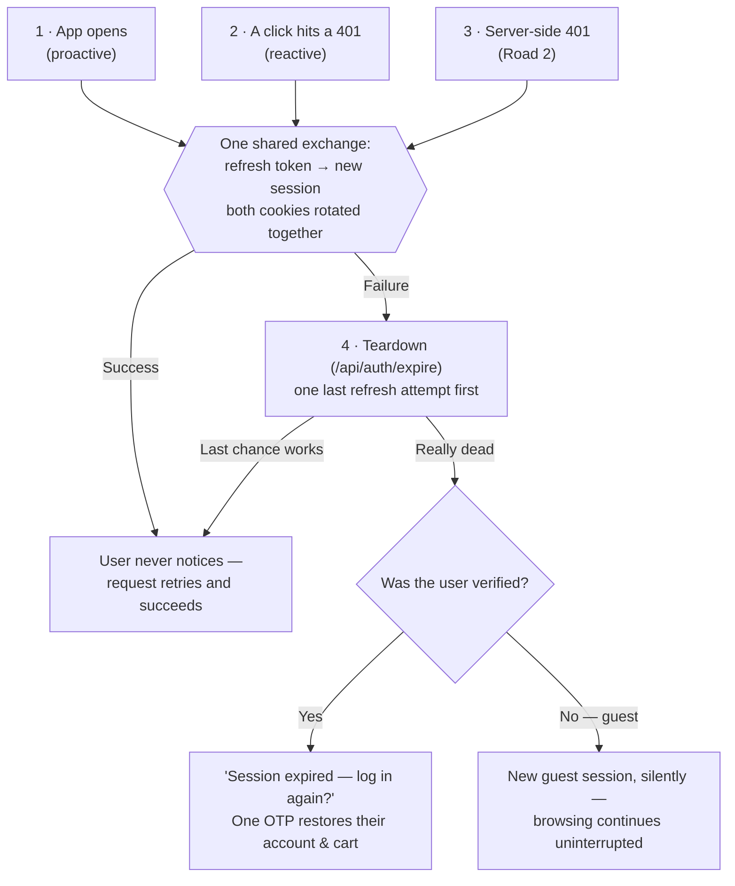

# How Trydos Talks to Its Backends

A simplified map of **every way the app fetches data**, which backend serves what,
and how an expired session silently renews itself.

> Backends are named by **role**, never by technology (see CLAUDE.md "Stack-agnostic naming").
> For the deep-dive on session renewal, see [REFRESH-FLOWS.md](./REFRESH-FLOWS.md).

---

## 1. The big picture

Every piece of data in the app travels one of **three roads**. Auth tokens live only in
HttpOnly cookies — the browser JavaScript never sees or sends them; the server attaches
them.

| Road | Who uses it | How auth works |
|---|---|---|
| **1 — Client → proxy** | Buttons, forms, live UI (`utils/fetchData.ts`) | Request goes to `/api/proxy`; the server reads the HttpOnly cookie and injects the token before forwarding |
| **2 — Server-side** | Pages rendered on the server, server actions (`serverRequests/HandleAuthedFetch.ts`) | Server reads the `MARKET-TOKEN` cookie directly and calls the backend |
| **3 — Internal routes** | Auth housekeeping (login, refresh, logout, expire) | Same-origin fetch; cookies travel automatically |

---

## 2. The backends

| Backend (role) | What it serves | Token used |
|---|---|---|
| **Core** | Verified (phone-confirmed) shoppers — their entire market traffic | `MARKET-TOKEN` |
| **Gateway** | Guests — registration and an allow-list of guest endpoints (cart, home settings, product details, customer profile, …) | `MARKET-TOKEN` |
| **Search** | Product search & listings | none |
| **Chat** | Live chat | `CHAT-TOKEN` |
| **Stories** | Stories / live video | `STORIES-TOKEN` |
| **Comments** | Product comments | user-id hash |
| **Wallet** | Wallet / balance | `WALLET-TOKEN` |
| **Media upload** | Story uploads (direct, no cookies) | none |

### Which of the two market backends answers?

One rule, decided fresh on every request from the `User-Data` cookie:

- **Verified shopper → always Core.**
- **Guest → Gateway** for allow-listed endpoints, Core for the rest.
- **Seller-dashboard traffic** skips the user check: it routes purely by endpoint (allow-listed → Gateway, otherwise Core).
- Both backends share one database, so a session issued by either is valid on both.
- This is a *routing* decision only — each backend still verifies the token itself.

---

## 3. Road 1 in detail — client fetch (`fetchData`)

Beyond routing, the client fetcher gives every request the same safety net:

Guarantees:

- **No duplicate requests** — identical concurrent calls share one response; optional caching for repeat reads.
- **Reads retry, writes never do** — a write could have already succeeded when the network dropped, so retrying it might duplicate it (e.g. post a comment twice).
- **Logout aborts everything** — the moment logout starts, all in-flight requests are cancelled so a late reply can't resurrect the old session.

---

## 4. Road 2 in detail — server-side fetch (`HandleAuthedFetch`)

Server-rendered pages and server actions fetch with the `MARKET-TOKEN` cookie.
On a 401 the server tries to recover **only when it can safely save new cookies**:

The one non-negotiable rule: a **verified shopper is never silently downgraded to a
guest** by the server. If recovery needs the user, the client asks them.

---

## 5. Session renewal — the refresh logic

Sessions expire. Instead of logging people out, the app holds a second, long-lived
**refresh token** (30 days, single-use, HttpOnly) and swaps it for a fresh session —
invisibly. The exchange always goes to the backend that serves that user
(verified → Core, guest → Gateway).

It runs at four moments:

What makes it safe:

- **Refresh for market, chat, and stories sessions.** Comments and wallet have their own re-verify flow (a phone-confirmation widget) instead.
- **One refresh at a time.** Parallel failures share a single exchange — the single-use token is never burned twice.
- **Ties resolve toward the browser.** If two tabs race, the loser retries with the winner's fresh cookies instead of destroying them.
- **Tokens never appear in responses.** Renewal is delivered only as HttpOnly cookies.
- **Logout always wins.** Nothing refreshes or re-registers while a logout is in progress.

Full details, edge cases and monitoring: [REFRESH-FLOWS.md](./REFRESH-FLOWS.md).

---

## 6. One-paragraph summary (for the non-technical reader)

The app reaches its backends through a single guarded doorway on our own server, which
attaches the right key (token) for each service — keys are never exposed to the
browser. Verified customers are served by the core backend, guests by the gateway.
When a session quietly expires, the app renews it in the background using a refresh
token; a shopper only ever sees a prompt if renewal is truly impossible, and one OTP
puts them straight back into their account. Guests never see anything at all.
