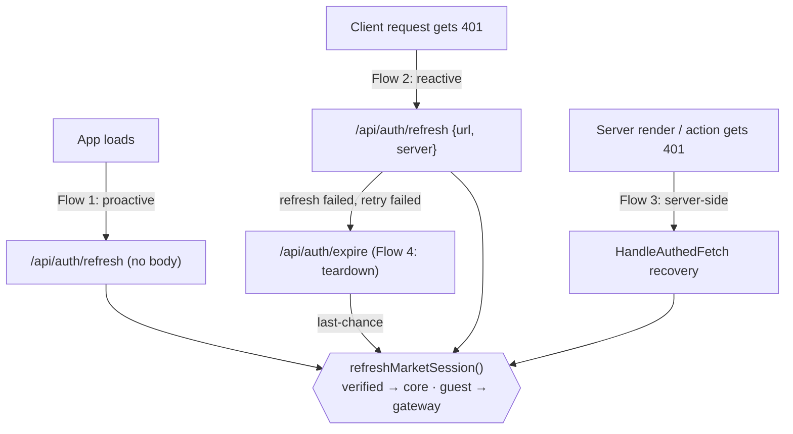
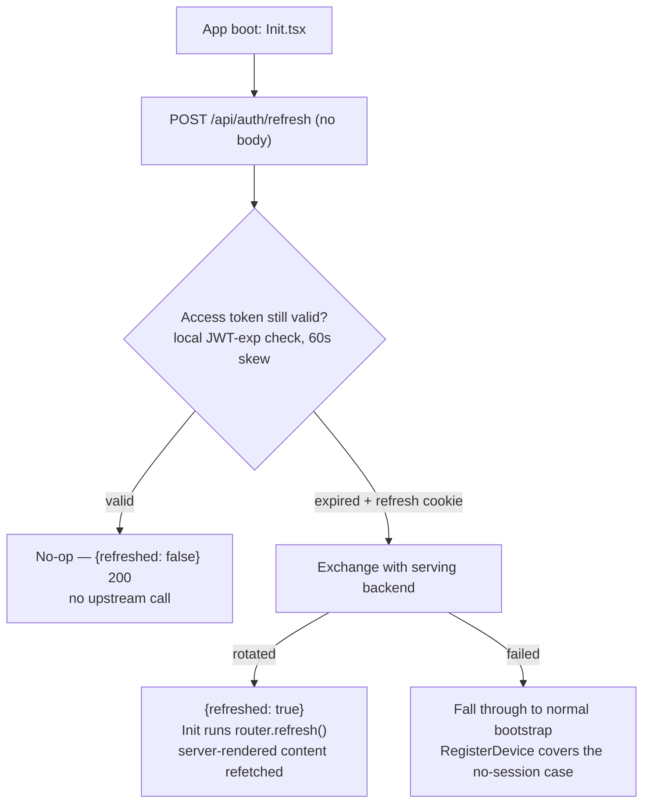
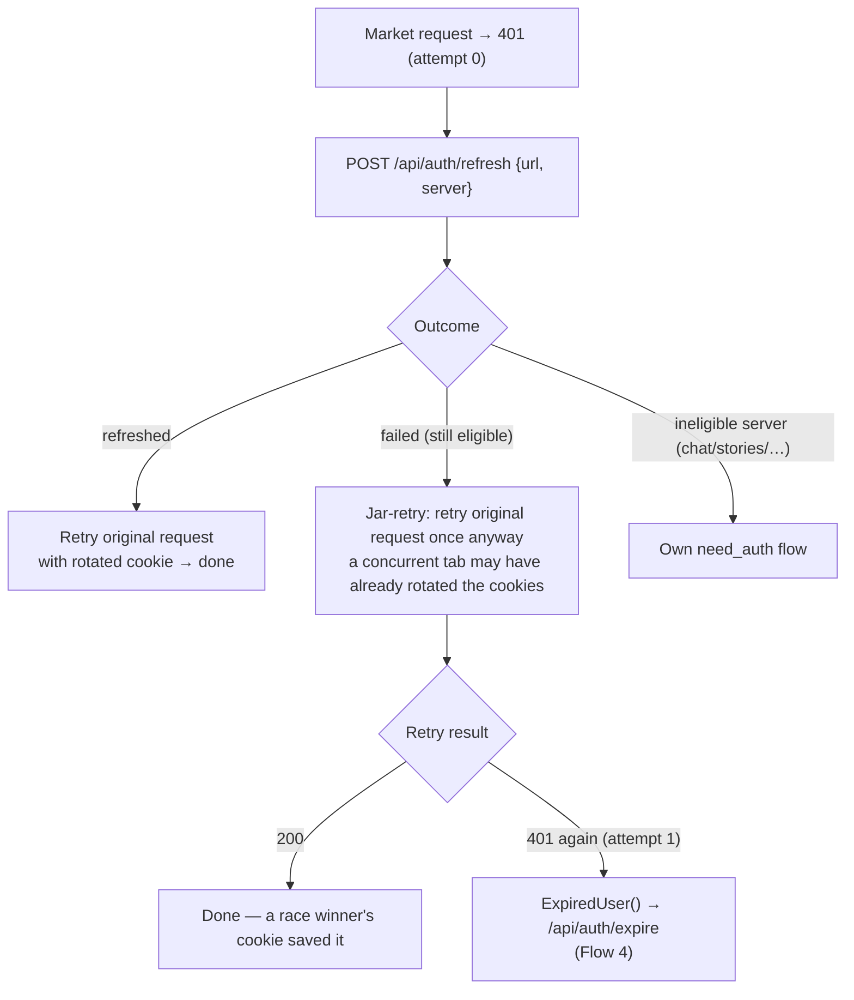
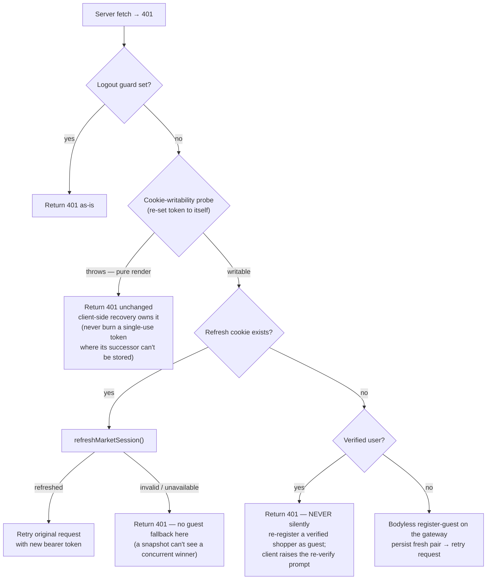
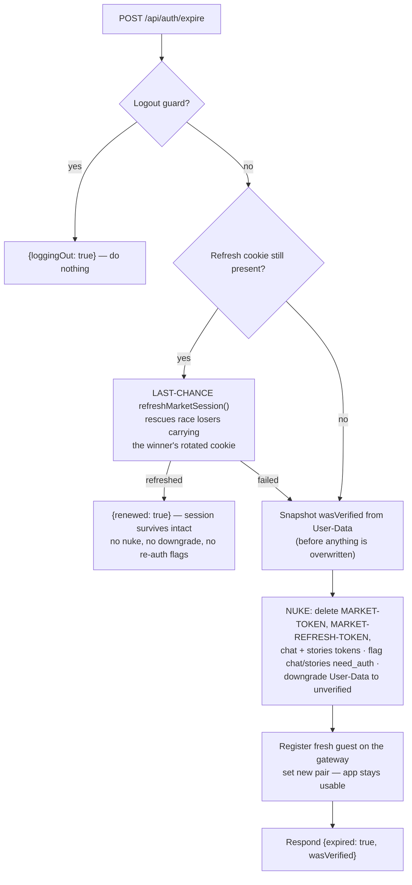
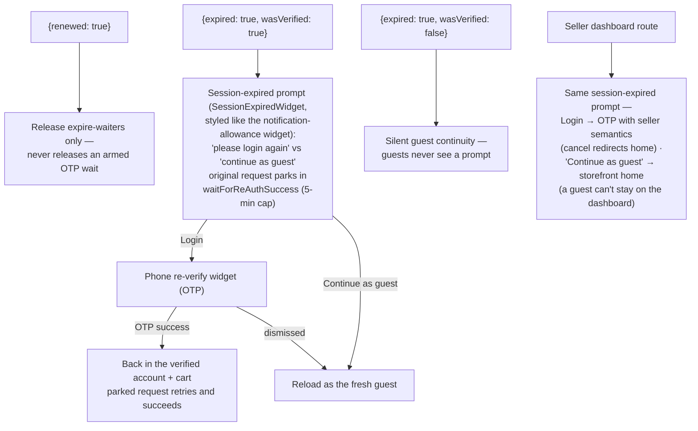

# Session Refresh Flows

How the app silently renews the market session (`MARKET-TOKEN` + `MARKET-REFRESH-TOKEN`)
across every entry point — and what happens when renewal fails.

> Source of truth: the code referenced in each section. Backends are named by role
> (see CLAUDE.md "Stack-agnostic naming"): the **gateway** serves guests, the
> **core** backend serves verified users.

---

## The building blocks

| Piece | What it is |
|---|---|
| `MARKET-TOKEN` | HttpOnly access-token cookie — the single auth cookie for guest **and** logged-in users. |
| `MARKET-REFRESH-TOKEN` | HttpOnly refresh cookie, 30 days, **single-use** — every exchange rotates both cookies together. |
| `refreshMarketSession()` | The one shared exchange helper (`utils/server/authRefresh.ts`). Routes by user type: **verified → core**, **guest → gateway** (both share one DB, so a pair minted by either validates on both). Single-flighted per server instance. |
| `/api/auth/refresh` | Internal route wrapping the helper (`app/api/auth/refresh/route.ts`). Called proactively (no body) and reactively (`{url, server}` after a 401). Token material never appears in a response body — only `Set-Cookie`. |
| `/api/auth/expire` | The teardown fallback (`app/api/auth/expire/route.ts`). Runs only after refresh has failed; tries one **last-chance** refresh before nuking. |
| Logout guard | A short-lived cookie set during logout. Every flow checks it first — nothing mints or rotates credentials mid-logout. |

**Outcomes of `refreshMarketSession()`** — every flow branches on these:

| Outcome | Meaning | Caller reaction |
|---|---|---|
| `refreshed` | Pair rotated, cookies set on this response | Retry the original request |
| `no-token` | No refresh cookie (pre-rollout session) | Fall through to fallback flow |
| `invalid` | Upstream 401 — dead **or** raced. The cookie is *not* deleted here (a concurrent winner may have rotated it) | Fall through; only `/expire`'s nuke deletes it |
| `ineligible` | Logout in progress | Do nothing |
| `unavailable` | 5xx / network / malformed — never retried | Fall through to fallback flow |

---

## Map of all flows

All four flows converge on the same exchange helper — no flow talks to a
refresh endpoint directly.

---

## Flow 1 — Proactive refresh on app load

**Path:** `components/Home/Init.tsx` → `HomeService.CheckLogin()` (`services/home.ts:329`)
→ `auth.RefreshSession()` (`services/auth.ts:428`) → `POST /api/auth/refresh` (no body).

Runs once at boot, *before* anything reads the session.

The win: an expired-session page load self-heals with **same-account continuity** —
no guest re-register, no identity loss.

---

## Flow 2 — Reactive refresh on a client 401

**Path:** `utils/fetchData.ts:217-266` — applies to `server === "market" | "market-dashboard"` only.
`chat` / `stories` / `comments` / `wallet` keep their own `need_auth` re-auth flow and are **not** refreshable here.

Two rules to notice:

- **Refresh-first, once.** The refresh path runs only on the *first* 401 of a request.
- **The jar-retry is deliberate.** Even a failed refresh returns `true` so the request
  retries once from the browser cookie jar — races resolve toward the jar, never
  toward deleting cookies.

Concurrent 401s are deduplicated at every layer: `_refreshPromise` /
`_expirePromise` on the client (`services/auth.ts`), the `inflight` single-flight
inside the helper on the server.

---

## Flow 3 — Server-side recovery (`HandleAuthedFetch`)

**Path:** `serverRequests/HandleAuthedFetch.ts` — server components and server actions.

The **writability probe** is the key invariant: cookie writes silently no-op (or throw)
during pure render, and the refresh token is single-use — so the exchange only ever
runs where the rotated pair can actually be persisted.

---

## Flow 4 — Teardown: `/api/auth/expire`

**Path:** `services/auth.ts:460-533` → `app/api/auth/expire/route.ts`.
Reached only after Flow 2 failed twice (or from legacy expiry callers). This is the
call you see in the network tab when a session genuinely dies.

**Back on the client**, the response drives what the user sees:

The product rule behind all of it: **a verified shopper is never silently downgraded
to an anonymous guest** — one OTP puts them back into their real account.

---

## Cross-cutting invariants

1. **Single-use safety.** A refresh token is consumed only where the rotated pair can
   be persisted (route handlers, or after the writability probe). Both cookies are
   always written together.
2. **Races resolve toward the browser jar.** An upstream 401 never deletes the
   refresh cookie mid-flow; only `/expire`'s nuke deletes it, after its own
   last-chance attempt failed. Losers retry from the jar and inherit the winner's pair.
3. **Single-flight everywhere.** One exchange per server instance
   (`inflight`), one `/api/auth/refresh` and one `/api/auth/expire` round trip per
   page (client promise dedup) — parallel 401s share the outcome.
4. **No token material in bodies.** Renewal is delivered exclusively via
   HttpOnly `Set-Cookie`; responses carry only booleans.
5. **Logout wins.** The logout guard short-circuits every flow — nothing resurrects a
   session the user just ended.
6. **Backend routing is one rule.** Verified → core, guest → gateway — decided inside
   the shared helper only (same rule as `getMarketFetchBase`), never re-implemented
   by callers.

## Monitoring

If verified users reach Flow 4 *routinely*, the suspect is the core backend's
`/refresh-token` endpoint rejecting tokens that should be valid (not deployed on
that environment, or refusing gateway-minted pairs despite the shared DB). Watch
Sentry for `refresh-token exchange failed`, `refresh-token network failure`, and
`auth/expire route error`.
