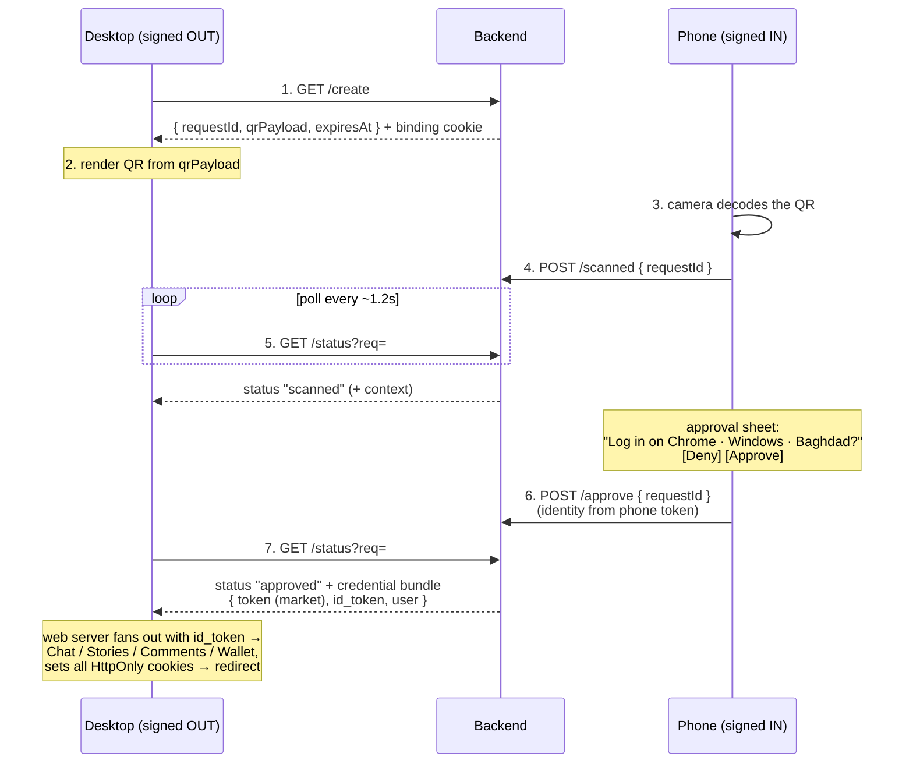

# QR Login — Backend Requirements (for the Go backend team)

> **Purpose:** the QR-login **frontend is already built and merged** on the web
> app. It runs today against a client-side *mock* (`services/qrLogin/index.ts`,
> backed by `localStorage`) so the UI is fully clickable without a server. This
> document is the spec the **real backend** must satisfy. When these endpoints
> exist, the web team swaps each mock function body for a `fetchData(...)` call —
> **the function names, arguments, and response shapes below must not change.**
>
> Owner: web team · Audience: Go backend team · Date: 2026-07-07

---

## 1. What the feature does

Cross-device login with no mobile app. A **signed-out desktop** shows a QR code;
the user's **signed-in phone browser** scans it and taps **Approve**; the desktop
is then logged in.



> **The approval handoff is a full login, not a single token.** See §5 — the Go
> backend must return the **same `{ token, id_token, user }` bundle it already
> returns from `/auth/phone/verify_otp_from_guest`**, because `id_token` is what
> logs the desktop into every other Trydos service.

The **critical backend-only job** the mock cannot do: on approval, **mint a
`MARKET-TOKEN` session for the desktop** and deliver it to the desktop browser.
Everything else is shared state + status transitions.

---

## 2. Session state model

A QR-login session is a short-lived server record keyed by an opaque `requestId`.

| Field | Type | Notes |
|---|---|---|
| `requestId` | string | **High-entropy, unguessable** (≥128 bits, e.g. UUIDv4 or random URL-safe token). This is what travels inside the QR. |
| `status` | enum | `pending → scanned → approved` \| `denied` \| `expired` |
| `expiresAt` | epoch ms | **~60 s TTL** from creation. Enforced server-side. |
| `context` | object | `{ browser, os, city? }` — derived **server-side** from the *create* request (see §4). Shown to the approver. |
| `approvedUserId` | string | set at approve, from the **phone's token** — never from the client. |
| `desktopBinding` | secret | server-side secret that ties the session to the **creating desktop** so only it can collect the minted token (see §5). |

Allowed transitions (anything else is a no-op / 409):

- `pending → scanned` (via `scanned`)
- `pending|scanned → approved` (via `approve`)
- `pending|scanned → denied` (via `deny`)
- any non-settled state → `expired` once `now > expiresAt`
- `approved` / `denied` are **terminal**; do not un-settle them.

Storage: use short-TTL shared storage (Redis is already in the stack). Set the
key TTL to `expiresAt` + a small grace window so records self-clean.

---

## 3. Endpoints

Base path `/api/qr-login/*` (the web app proxies to the Go backend as it does for
other auth routes). Types are the exact TypeScript contract the frontend expects.

```ts
type QrStatus  = "pending" | "scanned" | "approved" | "denied" | "expired";
type QrContext = { browser: string; os: string; city?: string };
type QrUser    = { name: string; image?: string };
type QrSession = { requestId: string; qrPayload: string; expiresAt: number };
type QrStatusResult = { status: QrStatus; user?: QrUser; context?: QrContext };
```

### 3.1 Create — `GET /api/qr-login/create`
- **Auth:** none (caller is signed out). 
- **Action:** create a `pending` session; capture `context` from request headers
  (§4); set the **desktop-binding cookie** on the response (§5).
- **Response 200:**
  ```json
  { "requestId": "…", "qrPayload": "trydos://qr/…", "expiresAt": 1751880000000 }
  ```
  - `qrPayload` MUST be `trydos://qr/<requestId>` (the scanner parses this scheme;
    it also accepts an `?req=<requestId>` query fallback — keep `requestId`
    retrievable from whatever string you put here).
- **Rate limit:** yes — cheap to spam (see §7).

### 3.2 Status — `GET /api/qr-login/status?req=<requestId>`
- **Called server-to-server** by the web app's own Next route (which the browser
  polls same-origin), **not** by browser JS directly — so the credential bundle
  never touches the client. Must present the desktop-binding proof (§5) to receive
  the bundle on approval. Polled ~every **1.2 s** while the panel is open.
- **Action:** return current status. If `now > expiresAt` and not settled →
  `expired`. **On `approved`:** return the **full credential bundle** for the
  approving user — the *same shape `/auth/phone/verify_otp_from_guest` returns*
  (§5) — so the web app can complete the login. Gate the bundle on the binding.
- **Response 200 (pending/scanned):**
  ```json
  { "status": "scanned", "context": { "browser": "Chrome", "os": "Windows", "city": "Baghdad" } }
  ```
- **Response 200 (approved) — the bundle:**
  ```json
  {
    "status": "approved",
    "data": {
      "token":      "<market/inventory token>",
      "id_token":   "<fresh otp_id_token — logs into all sub-services>",
      "user":       { "id": "…", "name": "Sara", "phone": "…", "email": "…", "image": "…" },
      "already_exists": true,
      "expires_at": 1751880000000
    }
  }
  ```
  - `context` present for `pending`/`scanned`. The `data` bundle is present only on
    `approved` and only to the bound desktop.
- The web server strips tokens before anything reaches the browser (exactly as
  `/api/auth/login` does today). **Tokens never appear in a browser-visible body.**

### 3.3 Scanned — `POST /api/qr-login/scanned`
- **Auth:** phone is signed in; token optional here but recommended. 
- **Body:** `{ "requestId": "…" }`
- **Action:** `pending → scanned` (no-op if already settled/expired). Lets the
  desktop flip to "Found on a device — approve on your phone".
- **Response 200:** `{ "ok": true }` (204 also acceptable; frontend ignores body).

### 3.4 Approve — `POST /api/qr-login/approve`  ⚠️ security-critical
- **Auth:** **REQUIRED** — reads the phone's `MARKET-TOKEN` cookie.
- **Body:** `{ "requestId": "…" }`
  - **The mock passes a `user` object; the real endpoint MUST ignore any
    client-supplied identity.** Derive the approving user **only** from the
    verified `MARKET-TOKEN`. Do not trust a client value as identity.
- **Action:** validate token → resolve user → set session `approved` +
  `approvedUserId` + store the resolved `user` for the desktop's greeting. Reject
  if session is expired/settled or token missing/invalid.
- **Response 200:** `{ "ok": true }`; **401** if not signed in, **409** if the
  session is no longer approvable, **404/410** if unknown/expired.

### 3.5 Deny — `POST /api/qr-login/deny`
- **Auth:** signed in (same token check as approve).
- **Body:** `{ "requestId": "…" }`
- **Action:** `pending|scanned → denied` (terminal). 
- **Response 200:** `{ "ok": true }`.

---

## 4. Context must be derived server-side

The mock reads `navigator.userAgent` on the phone — **wrong source** for the real
flow. The approver needs to see **the desktop's** context, so the backend must
capture it **at create time** from the *desktop's* request:

- `browser` / `os` — parse the **create** request's `User-Agent`.
- `city` — geo-lookup from the **create** request IP (best-effort; omit if
  unavailable — it's optional in the type).

Return that stored `context` from `status`. Do **not** accept context from the
phone's client.

---

## 5. The handoff is a FULL login — return the OTP-verify credential bundle ⚠️

This is the heart of the feature and the one thing the mock can't model. **A
Trydos login is not one token — it is a fan-out across five services**, and QR
approval must produce the exact same result as a normal OTP login.

### 5.1 How a normal login already works (this is the target)

`app/api/auth/login/route.ts` (a web-side Next route) does, on OTP verify:

1. Calls the core backend's `POST /auth/phone/verify_otp_from_guest` → gets back
   **`{ token, id_token, user, already_exists, expires_at }`**.
   - `token` → market/inventory session (`MARKET-TOKEN` cookie)
   - **`id_token` (the `otp_id_token`)** → the master credential the other services trust
   - `user` → profile (`User-Data` cookie)
2. Using that **`id_token`**, the web server fans out **in parallel** to four more
   backends and sets their tokens as HttpOnly cookies:

   | Service | Endpoint | Sends | Cookie set |
   |---|---|---|---|
   | Chat | `CHAT_BACKEND/api/v1/users/login` | `otp_id_token`, `mobile_phone`, `name`, `original_user_id` | `CHAT-TOKEN` |
   | Stories | `STORIES_BACKEND/api/v1/users/login` | `otp_id_token`, `mobile_phone`, `original_user_id` | `STORIES-TOKEN` |
   | Comments | `COMMENT_BACKEND/public_comment/auth/exchange_token` | `id_token`, `user_id`, `phone` | `USER-ID-HASH` |
   | Wallet | `WALLET_BACKEND/auth/phone/login-with-id-token` (+ `X-merchant-api-key`) | `otp_id_token`, `mobile_phone`, name, email | `rdb_at` |

### 5.2 What this means for QR — the backend's real job

**QR approval must yield the same `{ token, id_token, user }` bundle that
`/auth/phone/verify_otp_from_guest` yields today** — just triggered by the phone's
approval instead of an OTP code. Concretely:

- At **approve** (§3.4), the backend authenticates the phone via `MARKET-TOKEN`,
  then mints **for that user** a fresh **market `token`** *and* a fresh
  **`id_token`** — identical in shape/claims to what OTP-verify issues. Store the
  bundle on the session.
- At **status → approved** (§3.2), return that bundle to the (bound) web server.
- **The web app does the rest.** It reuses the *existing* fan-out from
  `/api/auth/login` — chat/stories/comments/wallet logins + all cookie-setting —
  unchanged. **The Go backend does NOT need to call or know about chat, stories,
  comments, or wallet.** It only needs to hand over a valid `token` + `id_token` +
  `user`. If `id_token` is valid, every downstream login just works.

> **Bottom line for the backend team:** treat "QR approved" as a new way to reach
> the *same* code path that mints OTP-verify credentials. The single deliverable is
> a fresh **`otp_id_token` + market token + user** for the approving user. Nothing
> about the sub-services changes.

### 5.3 Bind the bundle to the creating desktop (don't leak it)

`requestId` is visible in the QR, and the bundle is powerful (it logs into
everything). So the bundle must reach **only the browser that created the
session**:

1. On **create**, set an **HttpOnly, Secure, SameSite=Lax** binding cookie on the
   desktop (e.g. `QR-DEVICE-BINDING`) with a random secret; store its hash on the
   session.
2. On **status → approved**, release the bundle **only if** the caller presents a
   binding matching the session. An unbound poll still gets the plain status (so
   error states render) but **never** the bundle.
3. Release the bundle **once**; invalidate the session + binding immediately after
   (no replay / double-mint).

Result: a public `requestId` is safe — approval needs the phone's token, and
collecting the credentials needs the desktop's binding.

---

## 6. Security requirements (checklist)

- [ ] `requestId` ≥128-bit CSPRNG, single-use, **60 s TTL**, enforced server-side.
- [ ] **Identity from `MARKET-TOKEN` only** on approve/deny; ignore client identity.
- [ ] The approved **credential bundle** (`token` + `id_token` + `user`) is
      released **only** to the bound web server (§5.3) — never to browser JS, never
      to an unbound poller. The web layer strips tokens before the browser sees any
      response (as `/api/auth/login` already does).
- [ ] The minted `token` + `id_token` match the shape/claims of OTP-verify output,
      so the existing sub-service fan-out (chat/stories/comments/wallet) works
      unchanged.
- [ ] Approve/deny require a **valid** signed-in token; 401 otherwise.
- [ ] Terminal states (`approved`/`denied`/`expired`) are immutable; the bundle is
      released once (no replay / double-mint).
- [ ] `context` derived server-side from the **create** request, not client input.
- [ ] Rate-limit `create` and `status` (§7).
- [ ] **Phishing note:** QR-login flows can be socially engineered (an attacker
      gets a victim to approve the *attacker's* QR). Mitigate by making the
      approval sheet show clear device + **location** context (already designed),
      keeping TTL short, and — recommended — logging/alerting on approvals from a
      geo far from the phone. Please confirm whether you want an approval audit
      log + notification (see open questions).
- [ ] All cookies `Secure` + `HttpOnly` + appropriate `SameSite`; HTTPS only.

---

## 7. Non-functional

- **Polling load:** the desktop polls `status` every **~1.2 s** for up to ~60 s
  (≈50 hits/session). Keep `status` cheap (single Redis GET, no heavy joins).
  Consider `Cache-Control: no-store`. (Long-poll/SSE is a nice-to-have, **not**
  required — the frontend polls; don't change the contract for it now.)
- **Rate limits:** `create` — a few per IP per minute (QR spam guard). `status` —
  allow the ~1/s poll but cap abusive bursts. Fits the existing Vercel Firewall +
  Upstash/Redis limiter approach; auth-sensitivity here warrants a business-logic
  limit on `create`/`approve`.
- **Idempotency:** repeated `scanned`/`approve`/`deny` for the same `requestId`
  must be safe no-ops after the first settling call.
- **Clock:** `expiresAt` is epoch **milliseconds**; TTL enforced by the server,
  not the client (the client only uses it for display/expiry hints).

---

## 8. What the frontend already handles (so you don't have to)

- Rendering the QR from `qrPayload`, camera scanning/decoding, the approval sheet,
  all copy/i18n, expiry display, and polling cadence.
- **The entire sub-service fan-out** (chat/stories/comments/wallet logins with
  `id_token`, and setting all HttpOnly cookies) — this already exists in
  `app/api/auth/login/route.ts` and the web team reuses it. You only supply the
  `{ token, id_token, user }` bundle (§5).
- On `approved`, the desktop currently shows a demo success state; once your
  `status` returns the bundle, the web team runs the fan-out and redirects into the
  signed-in app (web-side change, tracked on our side).

## 9. Open questions for the backend team

1. **Credential issuance:** can the approve step reach the same code that issues
   OTP-verify credentials, so `status → approved` can return a fresh
   `{ token, id_token, user }` bundle for the approving user? (This is the one hard
   requirement — see §5. If you'd rather expose it as a dedicated
   `POST /api/qr-login/exchange` the web server calls once on `approved` instead of
   inlining it in `status`, that's fine too — either shape works for us.)
2. **Binding mechanism:** OK to set the §5 device-binding cookie on `create`, or
   do you want the desktop to send a self-generated nonce it also embeds in the
   QR? (We recommend the server-set cookie — keeps the nonce out of the QR.)
3. **Approval audit/notification:** do you want to record approvals (device, geo,
   time) and/or push an FCM notification to the user on approve? (Recommended for
   security; not required for v1.)
4. **Geo/city source:** is server-side IP→city available in the Go layer, or
   should we drop `city` for v1?

---

## 10. Endpoint summary

| Method | Path | Auth | Body | Returns |
|---|---|---|---|---|
| GET  | `/api/qr-login/create` | none | — | `{ requestId, qrPayload, expiresAt }` + sets binding cookie |
| GET  | `/api/qr-login/status?req=` | binding proof | — | `{ status, context? }`; **on `approved`, the `{ token, id_token, user }` bundle** (§5) |
| POST | `/api/qr-login/scanned` | signed-in (rec.) | `{ requestId }` | `{ ok: true }` |
| POST | `/api/qr-login/approve` | **signed-in (required)** | `{ requestId }` | `{ ok: true }` — mints the bundle; identity from token |
| POST | `/api/qr-login/deny` | signed-in | `{ requestId }` | `{ ok: true }` |

> The five services a Trydos login spans: **market/inventory** (`token`), **chat**,
> **stories**, **comments**, **wallet** — the last four are logged in by the web
> server using the **`id_token`**, so the backend only owns `token` + `id_token`.

Once these are live on `NEXT_PUBLIC_GO_BACKEND_URL`, we point the mock at them,
run the two-device test (desktop QR ↔ phone approve), and the feature is ready to
go live.
</content>
</invoke>
